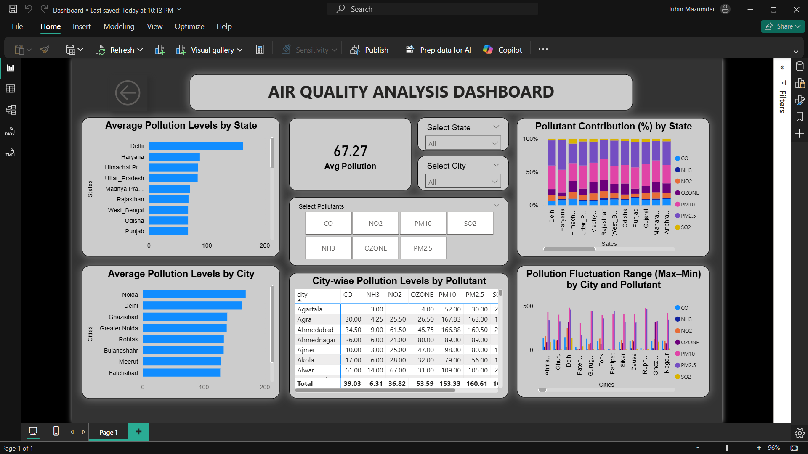
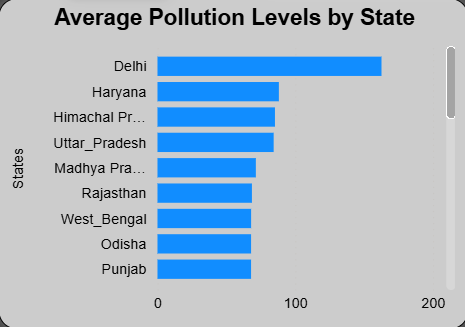
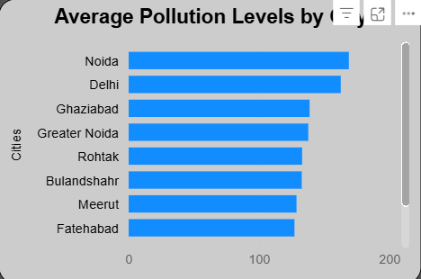
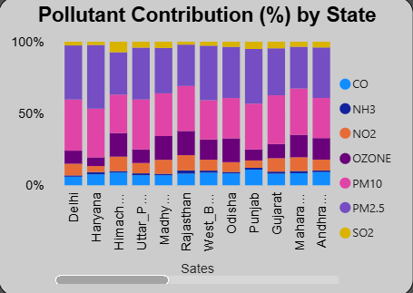
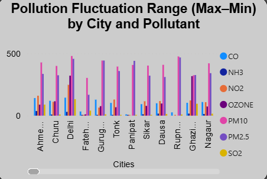

# Air-Quality-Analysis-Dashboard

# Project Overview
This project presents an interactive Air Quality Analysis Dashboard developed using Microsoft Power BI. The objective of this project is to analyze air pollution levels across different Indian states and cities and identify pollution hotspots.

Air pollution is one of the most critical environmental and public health challenges in India. Rapid urbanization, industrial growth, vehicular emissions, and construction activities have significantly deteriorated air quality across major regions. This dashboard provides insights that can assist policymakers, researchers, and environmental agencies in monitoring pollution trends and planning mitigation strategies.

# Dataset Information
The dataset contains state-wise and city-wise pollution levels with the following attributes:
- State
- City
- Pollutants
  - CO (Carbon Monoxide)
  - NO₂ (Nitrogen Dioxide)
  - SO₂ (Sulfur Dioxide)
  - NH₃ (Ammonia)
  - Ozone
  - PM10
  - PM2.5

# Tools and Technologies Used
- Microsoft Power BI
- Data Modeling
- DAX Measures
- Bar Charts
- Stacked Column Charts
- Cards
- Slicers and Cross-filtering

# Key Analysis and Findings
1. Average Pollution Levels by State
Delhi records the highest average pollution level, followed by Haryana and Uttar Pradesh. States such as Odisha and Punjab show comparatively lower pollution levels.

  

3. Average Pollution Levels by City
Cities such as Noida, Delhi, Ghaziabad, and Greater Noida exhibit high pollution levels. Urban congestion and industrial activity are major contributors.

5. Pollutant Contribution Analysis
PM10 and PM2.5 dominate pollution composition across most states. Gaseous pollutants like CO, NO₂, and SO₂ contribute smaller proportions. Particulate matter is the major concern.

7. Pollution Fluctuation Range
PM10 and PM2.5 show the largest fluctuation ranges across cities, indicating seasonal effects and inconsistent pollution control.

Overall Average Pollution Index: 67.27
This reflects a moderately high pollution level overall.

# Dashboard Features
- State, City, and Pollutant slicers
- Dynamic cards updating based on filters
- Cross-filtering between visuals
- Interactive and user-friendly layout
- Clear visual hierarchy for easy interpretation

